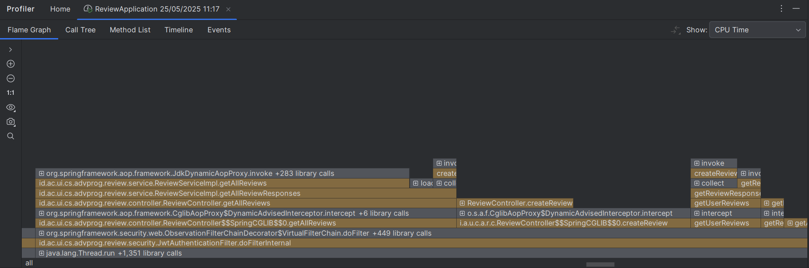
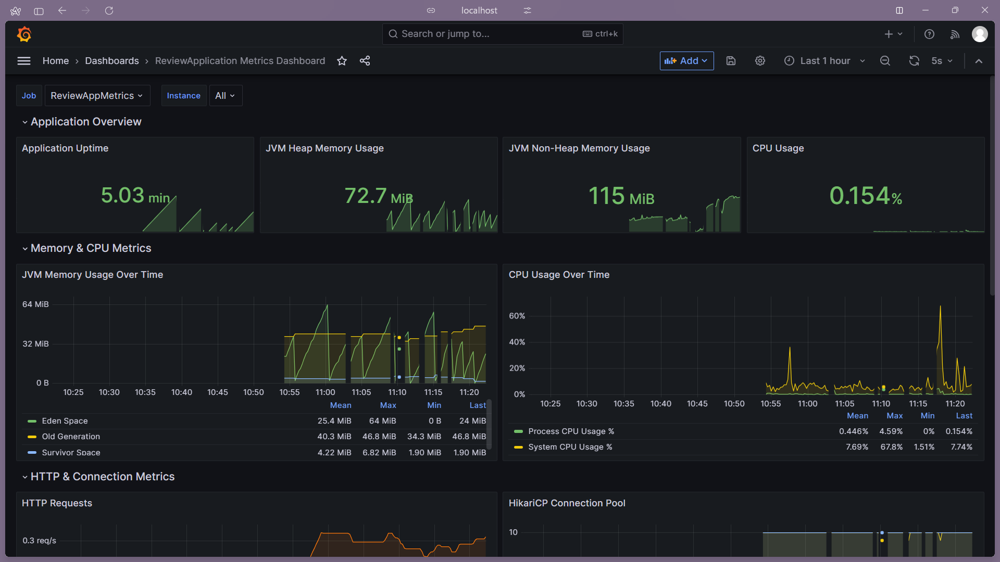

# Review Service

A16 | Pemrograman Lanjut Genap 2024/2025

Haliza Arfa | 2306211401

---

**Komponen**:
1. Software Design
2. Software Quality
3. Software Architecture
4. Software Deployment

---

**Implementasi Milestone**:

Sudah dibangun struktur untuk sistem Review, yang meliputi pengembangan model, controller, service, DTO, dan repository untuk manajemen ulasan pengguna terhadap teknisi.
Sistem sudah terintegrasi dengan Authentication untuk mekanisme otorisasi JWT Token, dan menerapkan role-based access pada endpoint dengan memanfaatkan Spring Security dan anotasi @PreAuthorize.
Fungsionalitas review memungkinkan user memberikan penilaian dan komentar untuk teknisi, serta kemampuan untuk mengedit atau menghapus review yang telah mereka buat. Admin diberikan hak khusus untuk menghapus review yang dianggap tidak sesuai.
Dari perspektif high-level networking, sistem telah mengimplementasikan komunikasi antar layanan melalui REST API dengan mekanisme autentikasi JWT untuk keamanan.
Telah dilakukan profiling dan monitoring untuk memantau performa sistem serta mengidentifikasi bottleneck. Koneksi ke frontend sudah berhasil dilakukan.
Endpoint-endpoint RESTful yang telah dikembangkan untuk manajemen review dan rating teknisi sudah terhubung dengan UI pengguna secara secara asynchronous menggunakan fetch API dengan async/await.

---

## 1. **Software Design**

**SOLID Principles**

- **Single Responsibility Principle (SRP)**: Setiap komponen memiliki tanggung jawab tunggal yang jelas - ReviewController menangani HTTP request, ReviewService mengelola logika bisnis, dan Review model merepresentasikan struktur data.
- **Open/Closed Principle (OCP)**: Desain interface ReviewService memungkinkan perluasan fungsionalitas tanpa perlu memodifikasi kode yang sudah ada.
- **Liskov Substitution Principle (LSP)**: Penerapan abstraksi sudah bersifat konsisten, terutama dalam implementasi service yang menggunakan interface, memastikan substitusi yang sesuai.
- **Interface Segregation Principle (ISP)**: Interface ReviewService hanya berisi metode yang relevan dan dibutuhkan untuk operasi review.
- **Dependency Inversion Principle (DIP)**: Implementasi constructor injection pada ReviewController dan ReviewServiceImpl meminimalkan ketergantungan langsung antar komponen.

**Maintainability**

- **Separation of Concerns**: Adanya pemisahan antara lapisan controller (ReviewController), service (ReviewService), model (Review), dan akses data (ReviewRepository).
- **Modularisasi**: Penggunaan ReviewDTO untuk memisahkan representasi data eksternal dari model internal, meningkatkan fleksibilitas sistem.
- **Readability**: Struktur kode terorganisir dengan penamaan metode yang intuitif, misalnya getReviewsByUserId, updateReview, dan deleteReviewByAdmin.
- **Testability**: Terdapat unit test yang menyeluruh untuk setiap bagian dengan coverage untuk berbagai skenario.

**Design Patterns**

Digunakan **Builder Pattern** pada model Review untuk memudahkan pembuatan objek dengan multiple required parameters secara terstruktur.
Pattern ini dipilih karena model Review memiliki banyak parameter pada constructornya, dan pattern ini memungkinkan validasi parameter saat construction time sehingga memastikan objek selalu dalam keadaan valid.

Selain itu, pattern lainnya yang digunakan adalah sebagai berikut.
- **DTO (Data Transfer Object)**: Penerapan ReviewDTO untuk menyediakan representasi data yang sesuai dengan kebutuhan komunikasi client-server.
- **Repository Pattern**: Implementasi ReviewRepository untuk abstraksi akses data, mempermudah pengelolaan dan pengujian kode.

**Asynchronous Programming**

Di sisi frontend, asynchronous programming diterapkan menggunakan fetch() API dengan async/await untuk melakukan pengambilan data secara non-blocking dari backend. 
Dengan ini, UI tetap responsif meskipun ada proses pengambilan data yang membutuhkan waktu. Pada backend, sistem juga didesain untuk mendukung komunikasi asynchronous dengan mekanisme RESTful API.

---

## 2. **Software Quality**

**Clean Code**
- **Separation of Concerns**: Pemisahan yang jelas antara penanganan request (ReviewController), logika bisnis (ReviewService), dan akses data (ReviewRepository).
- **Naming Conventions**: Penamaan yang deskriptif untuk class, metode, dan variabel, seperti ReviewController, getReviewById, dan createReview.
- **Readability**: Metode-metode pada kode dibuat secara ringkas dan fokus pada fungsi spesifik.

**Secure Coding**
- **JWT Authentication**: Mekanisme autentikasi JWT melalui JwtAuthenticationFilter dan JwtTokenProvider.
- **Role-Based Access Control**: Penerapan kontrol akses berdasarkan peran dengan @PreAuthorize untuk membatasi akses ke operasi tertentu.
- **Input Validation**: Validasi data masukan pada model Review dengan pemeriksaan nilai null, string kosong, dan rentang nilai untuk rating.
- **Security Config**: Konfigurasi keamanan melalui SecurityConfig yang mengatur aturan akses endpoint.

**Testing**
- **Unit Testing**: Pengujian untuk semua komponen utama aplikasi, termasuk controller, service, repository, dan model.
- **Mocking**: Pemanfaatan Mockito untuk mengisolasi pengujian unit dari dependensi eksternal.
- **Edge Cases**: Pengujian berbagai skenario termasuk validasi input, akses tidak sah, dan verifikasi hak akses.
- **Test Coverage**: Cakupan pengujian meliputi happy dan unhappy path.

---

## 3. **Software Architecture**

**Architecture**
- **Layered Architecture**: Struktur aplikasi yang tersusun dalam lapisan yang jelas (Controller, Service, Repository) untuk memisahkan fungsi dan tanggung jawab.
- **RESTful API**: Penerapan prinsip REST pada API dengan endpoint yang sesuai untuk operasi Create, Read, Update, dan Delete.

**High-Level Networking**
- **RESTful Communication**: Penggunaan REST untuk komunikasi antar layanan dan dengan client.
- **JWT-Based Authentication**: Pemanfaatan token JWT untuk komunikasi aman antar layanan, dengan autentikasi stateless.
- **Service Integration**: Integrasi dengan Authentication Service untuk validasi token dan ekstraksi data pengguna.
- **Cross-Origin Resource Sharing (CORS)**: Konfigurasi security yang mengakomodasi akses dari origin berbeda karena sifat microservice.
- **Stateless Protocol**: Implementasi API yang stateless dengan JWT untuk autentikasi, meningkatkan skalabilitas sistem.
- **Role-Based Security**: Penerapan filter keamanan untuk validasi token JWT dan ekstraksi peran untuk otorisasi akses.

---

## 4. **Software Deployment**

### Workflow CI-CD

Terdapat workflow CI/CD (Continuous Integration/Continuous Deployment) yang meliputi scorecard, build process, testing suite, dan automated deployment.
Pipeline CI/CD diimplementasikan menggunakan GitHub Actions, deployment dilakukan ke AWS Academy.

### Profiling dan Monitoring

#### Profiling dengan Intellij Profiler



#### Profiling-Monitoring dengan SpringBoot Actuator, Prometheus, Grafana


---

---

# API Reference Documentation

## Overview

This API provides endpoints for managing reviews and technician ratings in PerbaikiinAja service platform.
The API uses JWT authentication and role-based authorization.

## Authentication

All protected endpoints require a valid JWT token in the Authorization header:

```
Authorization: Bearer <your-jwt-token>
```

## User Roles

- **USER**: Regular users who can create and manage their own reviews
- **ADMIN**: Administrators with elevated permissions
- **TECHNICIAN**: Service technicians who can view reviews about their services

---

## Review Endpoints

### Get All Reviews

Retrieves all reviews in the system.

**Endpoint:** `GET /review`

**Authorization:** Requires `USER` or `ADMIN` role

**Response:**
```json
[
  {
    "id": "uuid",
    "userId": "uuid",
    "technicianId": "uuid",
    "technicianFullName": "string",
    "comment": "string",
    "rating": 5,
    "createdAt": "2024-01-01T12:00:00"
  }
]
```

**Status Codes:**
- `200 OK`: Success
- `401 Unauthorized`: Invalid or missing token
- `403 Forbidden`: Insufficient permissions

---

### Get Reviews by Technician (for Technicians)

Retrieves all reviews for the authenticated technician.

**Endpoint:** `GET /review/technician`

**Authorization:** Requires `TECHNICIAN` role

**Response:**
```json
[
  {
    "id": "uuid",
    "userId": "uuid",
    "technicianId": "uuid",
    "technicianFullName": "string",
    "comment": "string",
    "rating": 5,
    "createdAt": "2024-01-01T12:00:00"
  }
]
```

**Status Codes:**
- `200 OK`: Success
- `401 Unauthorized`: Invalid or missing token
- `403 Forbidden`: Not a technician

---

### Get User's Reviews

Retrieves all reviews created by the authenticated user.

**Endpoint:** `GET /review/user`

**Authorization:** Requires `USER` role

**Response:**
```json
[
  {
    "id": "uuid",
    "userId": "uuid",
    "technicianId": "uuid",
    "technicianFullName": "string",
    "comment": "string",
    "rating": 5,
    "createdAt": "2024-01-01T12:00:00"
  }
]
```

**Status Codes:**
- `200 OK`: Success
- `401 Unauthorized`: Invalid or missing token
- `403 Forbidden`: Not a user

---

### Get Review by ID

Retrieves a specific review by its ID.

**Endpoint:** `GET /review/{reviewId}`

**Authorization:** Requires `USER` or `ADMIN` role

**Path Parameters:**
- `reviewId` (UUID): The unique identifier of the review

**Response:**
```json
{
  "id": "uuid",
  "userId": "uuid",
  "technicianId": "uuid",
  "technicianFullName": "string",
  "comment": "string",
  "rating": 5,
  "createdAt": "2024-01-01T12:00:00"
}
```

**Status Codes:**
- `200 OK`: Success
- `404 Not Found`: Review not found
- `401 Unauthorized`: Invalid or missing token
- `403 Forbidden`: Insufficient permissions

---

### Create Review

Creates a new review.

**Endpoint:** `POST /review`

**Authorization:** Requires `USER` role

**Request Body:**
```json
{
  "technicianId": "uuid",
  "comment": "string",
  "rating": 5
}
```

**Response:**
```json
{
  "id": "uuid",
  "userId": "uuid",
  "technicianId": "uuid",
  "comment": "string",
  "rating": 5,
  "createdAt": "2024-01-01T12:00:00"
}
```

**Validation Rules:**
- `technicianId`: Required, must be a valid UUID
- `comment`: Required, cannot be empty
- `rating`: Required, must be between 1 and 5

**Status Codes:**
- `200 OK`: Review created successfully
- `400 Bad Request`: Invalid request body or validation errors
- `401 Unauthorized`: Invalid or missing token
- `403 Forbidden`: Not a user

---

### Update Review

Updates an existing review. Users can only update their own reviews.

**Endpoint:** `PUT /review/{reviewId}`

**Authorization:** Requires `USER` role

**Path Parameters:**
- `reviewId` (UUID): The unique identifier of the review to update

**Request Body:**
```json
{
  "comment": "string",
  "rating": 5
}
```

**Response:**
```json
{
  "id": "uuid",
  "userId": "uuid",
  "technicianId": "uuid",
  "comment": "string",
  "rating": 5,
  "createdAt": "2024-01-01T12:00:00"
}
```

**Status Codes:**
- `200 OK`: Review updated successfully
- `400 Bad Request`: User can only update their own reviews
- `404 Not Found`: Review not found
- `401 Unauthorized`: Invalid or missing token
- `403 Forbidden`: Not a user

---

### Delete Review

Deletes a review. Users can delete their own reviews, admins can delete any review.

**Endpoint:** `DELETE /review/{reviewId}`

**Authorization:** Requires `USER` or `ADMIN` role

**Path Parameters:**
- `reviewId` (UUID): The unique identifier of the review to delete

**Response:** Empty body

**Status Codes:**
- `200 OK`: Review deleted successfully
- `400 Bad Request`: Review not found or insufficient permissions
- `401 Unauthorized`: Invalid or missing token
- `403 Forbidden`: Insufficient permissions

---

## Technician Rating Endpoints

### Get All Technicians with Ratings

Retrieves all technicians along with their average ratings and review counts.

**Endpoint:** `GET /technician-ratings`

**Authorization:** Public endpoint (no authentication required)

**Response:**
```json
[
  {
    "technicianId": "uuid",
    "fullName": "string",
    "profilePhoto": "string",
    "specialization": "string",
    "experience": 5,
    "averageRating": 4.5,
    "totalReviews": 10
  }
]
```

**Status Codes:**
- `200 OK`: Success

---

### Get Technician's Own Rating

Retrieves rating information for the authenticated technician.

**Endpoint:** `GET /technician-ratings/technician`

**Authorization:** Requires `TECHNICIAN` role

**Response:**
```json
{
  "technicianId": "uuid",
  "fullName": "string",
  "profilePhoto": "string",
  "specialization": "string",
  "experience": 5,
  "averageRating": 4.5,
  "totalReviews": 10
}
```

**Status Codes:**
- `200 OK`: Success
- `404 Not Found`: Technician not found
- `401 Unauthorized`: Invalid or missing token
- `403 Forbidden`: Not a technician
